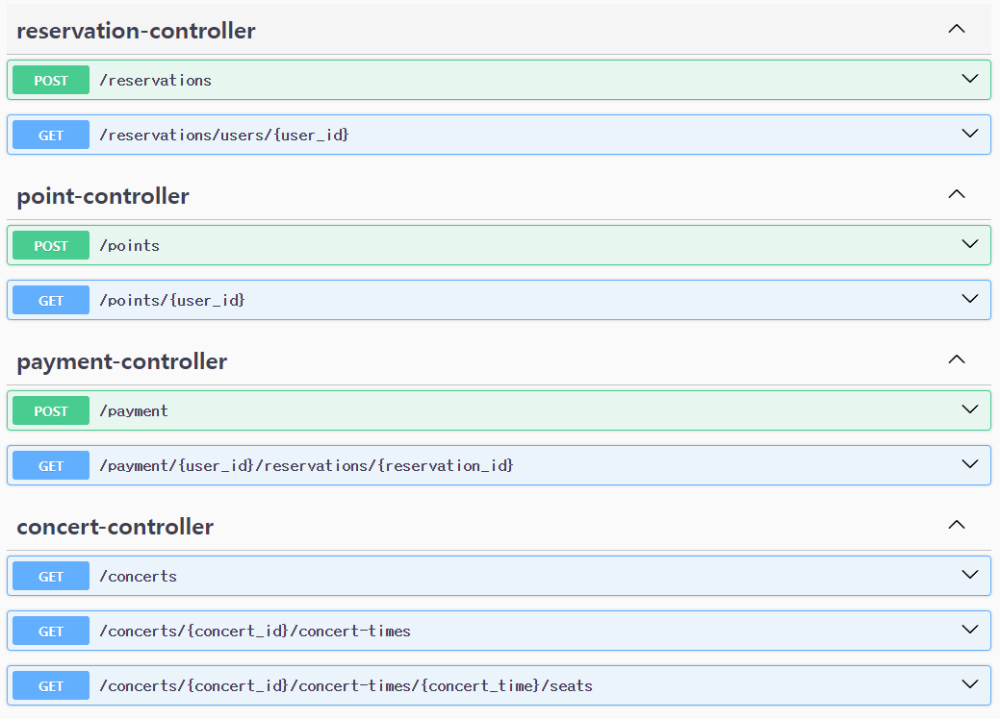
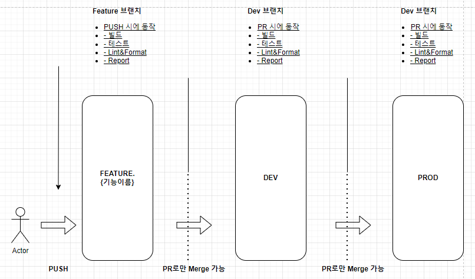

# 콘서트 티켓팅 서버 구축하기

---

## 요구사항 분석 및 기술정의서
[링크↗](https://github.com/watanka/ticketing/wiki/%EC%BD%98%EC%84%9C%ED%8A%B8-%ED%8B%B0%EC%BC%93%ED%8C%85-%EC%8B%9C%EC%8A%A4%ED%85%9C)

## 시퀀스 다이어그램
[API별 시퀀스 다이어그램↗](https://github.com/watanka/ticketing/wiki/%EC%84%B8%EB%B6%80-%EC%8B%9C%ED%80%80%EC%8A%A4-%EB%8B%A4%EC%9D%B4%EC%96%B4%EA%B7%B8%EB%9E%A8)

## ERD

## Swagger-UI

## 브랜치 전략
  

### 브랜치 전략 수립에 중요한 점

이 프로젝트는 Github Flow와 Git Flow 중 나 혼자 작업하는 프로젝트이기 때문에 Git Flow(Feature, Develop, Release, HotFix, Master) 보다는 비교적 단순한 Github Flow(Feature, Dev, Main)가 더 적합하다.

코드 반영시 특별히 유의해야할 사항은

1. 코드 추가/변경 사항 발생 시, 어떤 항목인지 명시적으로 알 수 있어야한다.
    - Commit Message 잘 쓰기
    - 작업할 기능단위로 브랜치를 FEATURE_{기능이름}로 작성하고, Dev 브랜치에 반영하는 PR에 기능을 꼼꼼히 적는다.
2. 배포되는 서버에 대한 검증용 브랜치가 따로 없는만큼, DEV와 PROD 환경을 동일하게 구성하고(Docker 활용) PROD 단계에서 문제가 없도록 구성한다.
    - DEV와 PROD환경에 차이가 있다면, 어떤 차이가 있는지 알아야한다.
    - PROD에서 문제가 없을 수 있도록 테스트 케이스에 특별히 유의하여 작성한다.