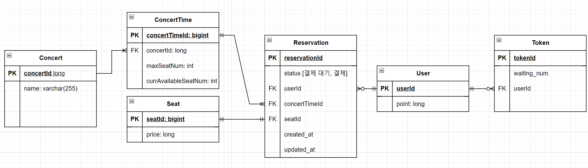

# 콘서트 티켓팅 서버 구축하기

---

## 요구사항 분석 및 기술정의서
[링크↗]([https://github.com/watanka/ticketing.wiki.git](https://github.com/watanka/ticketing/wiki/%EC%BD%98%EC%84%9C%ED%8A%B8-%ED%8B%B0%EC%BC%93%ED%8C%85-%EC%8B%9C%EC%8A%A4%ED%85%9C))

## 시퀀스 다이어그램

## ERD

## API 명세
| url                                                 | method   | 동작                                                   | Request                             | Response          |
|-----------------------------------------------------|----------|------------------------------------------------------|-------------------------------------|-------------------|
| `/queue/{concert_id}`                               | 	`POST`  | 	토큰 생성                                               | 	concert_id, user_id                | 	Token            |
| `/queue/{concert_id}?user_id={user_id}`             | `GET`    | 유저ID에 해당하는 토큰 조회                                     | concert_id, user_id                 | Token유무           |
| `/concerts/{concert_id}`                            | 	`GET`   | 	예약 가능 콘서트시간 조회                                      | 	token_id, concert_id	              | List[ConcertTime] |
| `/concerts/{concert_id}?concert_time={concert_time}` | 	`GET`   | 	예약 가능 좌석 조회                                         | 	token_id, conert_time_id           | 	List[Seat]       |
| `/reservation`                                      | 	`POST`  | 	예약 요청                                               | 	token_id, concert_time_id, seat_id | 	Reservation      |
| `/reservation/{user_id}`                            | `GET`    | 예약 조회                                                | userId                              | Reservation       | 
| `/points/{user_id}`                                 | 	`POST`  | 	금액 충전시	원하는 금액만큼 충전한다.                               | 	user_id, amount                    | 	point            |
| `/points/{user_id}`                                 | 	`GET`   | 	금액 조회시	보유중인 잔액 조회한다.                                | 	user_id                            | 	double point     |
| `/payments?reservation={reservation_id}`            | 	`POST`  | 	대기열에서 좌석 선택 후, 결제시 	선택한 좌석에 대한 금액을 외부api를 사용해 결제한다. | 	user_id, reservation_id            | 	Reservation      |
| `/payments/{user_id}`                               | `GET`    | 결제 내역 반환                            | user_id, reservation_id             | Reservation       |

- concert_id는 path로, 그리고 concert_time과 seat을 query로 두었다. concert_id는 티켓팅 프로세스동안 날짜와 좌석을 조회하고, 선택하는 프로세스동안 변하지 않고 고정된 값이라 query보다 가독성이 좋을 것이라고 판단했다.
- Response 형식을 특정하지 않고, 객체로 둔 이유는 결과값이 어떻게 나올지(dao, dto에 대해 잘 모름..) 아직 판단이 안 서기 때문에 대략 어떤 값을 리턴해야할지만 적어놓은 것이다. (24/04/04)

리퀘스트 정보를 DTO와 path, query 중 어디에 넘겨야할까? DTO정보는 body에만 담기는건가?
