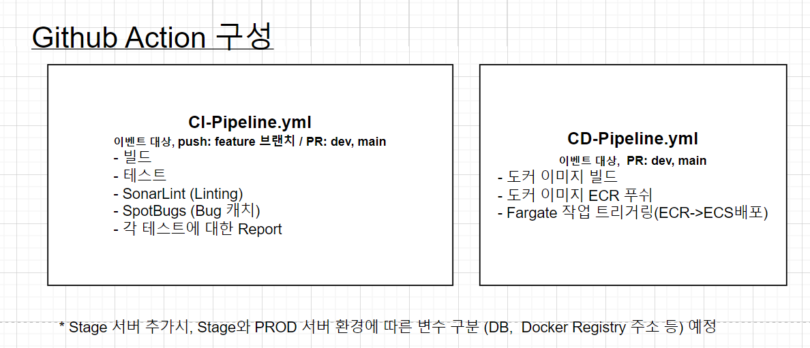
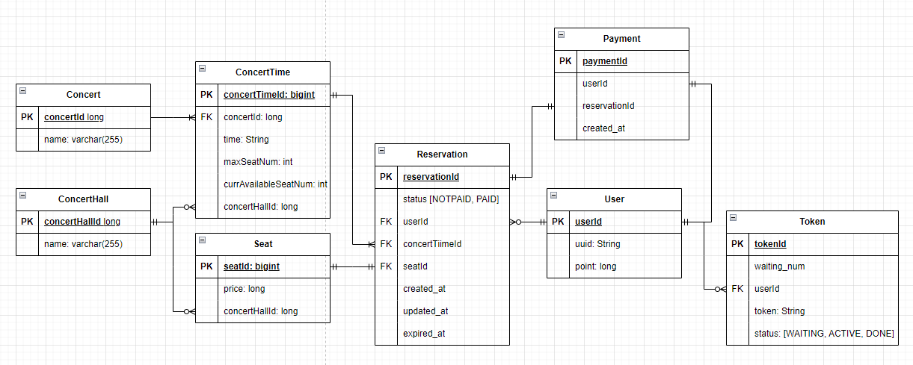
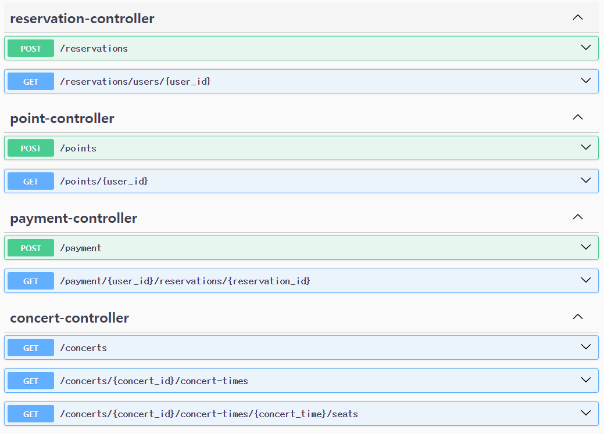

# 콘서트 티켓팅 서버 구축하기

---
## 요구사항 분석 및 기술정의서
[링크↗](https://github.com/watanka/ticketing/wiki/%EC%BD%98%EC%84%9C%ED%8A%B8-%ED%8B%B0%EC%BC%93%ED%8C%85-%EC%8B%9C%EC%8A%A4%ED%85%9C)

## 동시성 제어
동시성이 발생할 수 있는 경우

- 좌석 예약시
   - 한 좌석에 대해 동시에 여러 요청이 한번에 들어올 수 있음.
      - ✅ 낙관적 락: 가장 먼저 들어온 요청 외에 나머지를 다 실패시킨다.   
        장점: 
        - 좌석 예약은 제한된 자원(1자리)에 대한 경쟁(트랜잭션 충돌)이다. 가장 먼저 들어온 요청만 성공시키고, 나머지는 실패시키면 된다.
        - 비관적 락과 비교했을 때, 테이블에 대한 락이 걸리지 않기 때문에 비교적 빠르다.
        
        단점: 
        - 제한된 자원에 충돌 예상횟수가 높다. => 충돌
        - retry나 rollback에 대한 처리 => 사용자 경험 관점에서?
       
       
       
      - 비관적 락: 테이블에 락을 걸어, 다른 트랜잭션이 접근하지 못하도록 한다.  
        장점:
         - 예상 충돌 횟수가 높은만큼, 비관적 락을 사용해서 테이블을 잠그면 정합성을 더 잘 보호할 수 있다.
        단점:
         - 
      - 분산 락 
        - 해당 자원에 대해 여러 트랜잭션 처리 방법들이 있다고할 때, 전부다 분산락을 쓴다면 문제 없겠지만, 일부 처리에서 분산락이 아닌 DB락을 사용한다고 할 때, DB락을 사용한 처리가 분산락을 사용한 처리보다 먼저 처리되는 경우가 발생할 수 있다(분산락 네트워크 홉 > DB락 네트워크 홉)
        - 구현 난이도는 높음. 해본적이 없다..
 
 
 
- 포인트 잔액 충전 시
   - 포인트 충전 요청이 중복으로 들어올 수 있음(클릭 따닥)
      - 낙관적 락: 첫번째 요청
      - 비관적 락:
      - 분산 락:

## Github Action 구성

## 브랜치 전략

- [ ] 만약 DEV나 MAIN브랜치에 바로 push 해야하는 상황에는?

### 브랜치 전략 수립에 중요한 점

이 프로젝트는 Github Flow와 Git Flow 중 나 혼자 작업하는 프로젝트이기 때문에 Git Flow(Feature, Develop, Release, HotFix, Master) 보다는 비교적 단순한 Github Flow(Feature, Dev, Main)가 더 적합하다.

코드 반영시 특별히 유의해야할 사항은

1. 코드 추가/변경 사항 발생 시, 어떤 항목인지 명시적으로 알 수 있어야한다.
   - Commit Message 잘 쓰기
   - 작업할 기능단위로 브랜치를 FEATURE_{기능이름}로 작성하고, Dev 브랜치에 반영하는 PR에 기능을 꼼꼼히 적는다.
2. 배포되는 서버에 대한 검증용 브랜치가 따로 없는만큼, DEV와 PROD 환경을 동일하게 구성하고(Docker 활용) PROD 단계에서 문제가 없도록 구성한다.
   - DEV와 PROD환경에 차이가 있다면, 어떤 차이가 있는지 알아야한다.
   - PROD에서 문제가 없을 수 있도록 테스트 케이스에 특별히 유의하여 작성한다.

## profiles
- dev
- test
- prod

## 시퀀스 다이어그램
[API별 시퀀스 다이어그램↗](https://github.com/watanka/ticketing/wiki/%EC%84%B8%EB%B6%80-%EC%8B%9C%ED%80%80%EC%8A%A4-%EB%8B%A4%EC%9D%B4%EC%96%B4%EA%B7%B8%EB%9E%A8)

## ERD

## Swagger-UI

