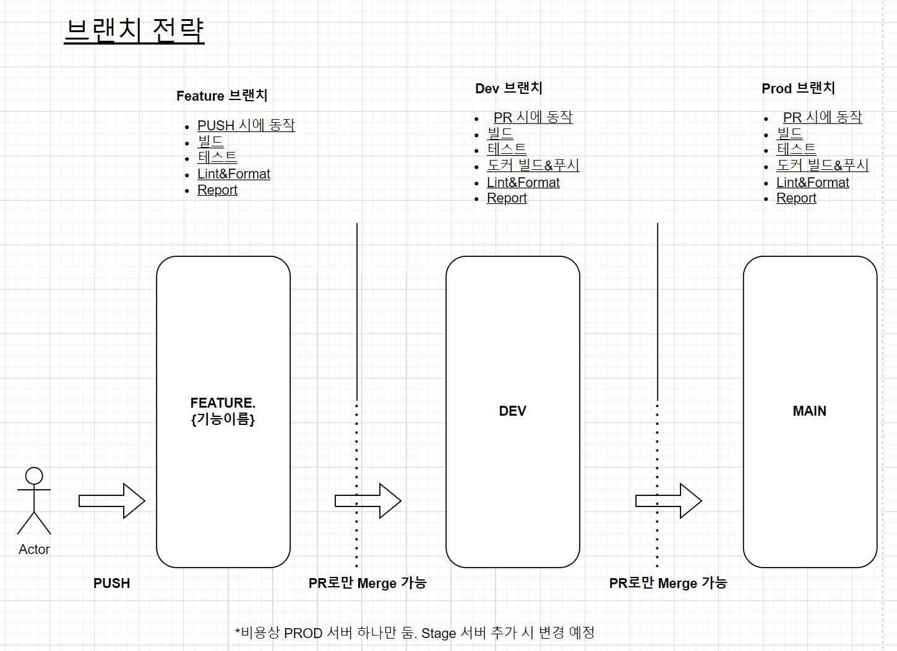

# 콘서트 티켓팅 서버 구축하기

---
## 요구사항 분석 및 기술정의서
[링크↗](https://github.com/watanka/ticketing/wiki/%EC%BD%98%EC%84%9C%ED%8A%B8-%ED%8B%B0%EC%BC%93%ED%8C%85-%EC%8B%9C%EC%8A%A4%ED%85%9C)

## 동시성 제어
**동시성이 발생할 수 있는 경우**

- **좌석 예약시**
   - 한 좌석에 대해 동시에 여러 요청이 한번에 들어올 수 있다. 첫번째 요청 이외에는 전부다 실패시켜야한다.
   - 적합한 락 종류 : **낙관적 락✅** (가장 먼저 들어온 요청 외에 나머지를 다 실패시킨다.)  
     - 사용자 관점: 예약 요청까지(트랜잭션 시도) 넘어가지만, 먼저 예약 트랜잭션을 성공(commit)시킨 다른 사용자가 있을 경우, 예약 성공에 실패한다.  
     **장점** 
       - 좌석 예약은 제한된 자원(1자리)에 대한 경쟁(트랜잭션 충돌)이다. 가장 먼저 들어온 요청만 성공시키고, 나머지는 실패시키면 된다.
       - 비관적 락과 비교했을 때, 테이블에 대한 락이 걸리지 않기 때문에 비교적 빠르다.
        
     **단점**
      - 데드락이 발생할 수 있다. (예를 들어 송금. 두 트랜잭션이 서로 물고있는 자원에 대해 대기하는 경우) 
      - 롤백이나 retry에 대한 처리가 복잡해질 수 있다.
        - rollback 처리를 application에서 직접해줘야한다.
          - 첫번째 요청 외에 전부다 실패시킨다. ⇒ 첫번째 외에 대기중인 트랜잭션들에 대한 시간 순서대로의 처리가 힘들다. ⇒ 첫번째 요청이 트랜잭션 커밋 후에 좌석 선점을 취소하는 상황이 벌어졌을 때, 대기순서가 아닌 단지 운좋게 타이밍이 맞은 다른 유저에게 선점권이 주어질 수 있다. ⇒ 대기중인 사용자들에게 공평하지 않다.
          - 트랜잭션 커밋 후에 좌석 선점이 취소되는 경우?
             - 결제를 5분안에 하지 않았을 경우
                - 트랜잭션 실패 후, 5분 이상 대기한 유저에게 우선권을 준다? ← 뭔가 이상하다.
                - 결제 유효시간이 지나 좌석상태가 다시 변환된 경우, 다른 처리가 없어도 된다.
 
 
 
- **포인트 잔액 충전 시**  
   - 포인트 충전 요청이나 사용이 동시에 들어올 수 있다. 모든 요청에 대해 순차적으로 처리해야한다.
   - 적합한 락 종류 : **비관적 락✅** (테이블에 락을 걸어, 다른 트랜잭션이 접근하지 못하도록 한다. 동시에 들어온 트랜잭션들을 시간 순서대로 처리한다.)   
     - 사용자 관점: 예약 요청까지(트랜잭션 시도) 넘어가지만, 락이 걸린 테이블을 조회(읽기/쓰기 포함)에서 대기가 걸려, 트랜잭션 성공(commit)까지 시간이 걸린다. 제대로 동작한다면, 기다리면 성공한다.  
     
     **장점**
     - 예상 충돌 횟수가 높은만큼, 비관적 락을 사용해서 테이블을 잠그면 정합성을 더 잘 보호할 수 있다.
     - 따로 retry나 rollback에 대한 처리를 해줄 필요가 없다.
     - 시간이 좀 더 걸릴 뿐, 모든 트랜잭션이 실패없이 처리된다.  
     
     **단점**
     - 진행중인 트랜잭션이 완료될 때까지 다른 트랜잭션은 해당 테이블에 접근하지 못 하기 때문에 비교적 느리다.
#### NOT FOR NOW(이번 주차는 DB락을 배우는데에만 집중)
- 분산 락
  - DB가 분산될 경우, 더이상 DB락을 사용할 수 없다.
  - 해당 자원에 대해 여러 트랜잭션 처리 방법들이 있다고할 때, 전부다 분산락을 쓴다면 문제 없겠지만, 일부 처리에서 분산락이 아닌 DB락을 사용한다고 할 때, DB락을 사용한 처리가 분산락을 사용한 처리보다 먼저 처리되는 경우가 발생할 수 있다(분산락 네트워크 홉 > DB락 네트워크 홉)
  - DB 커넥션을 얻기 전에 트랜잭션의 성공여부를 체크하기 때문에 DB락에서 데이터베이스에 연결하면서 생기는 DB부하를 해결해줄 수 있다.
  - 분산락에도 세가지 종류가 있다. `Simple Lock`, `Spin Lock`, `Pub/Sub`
  
  #### 콘서트 API에 적용한다면?
  - 하나 빼고 나머지는 다 실패해야하는 `좌석 선점`의 경우, 단순히 Lock 취득여부로 트랜잭션 성공여부를 결정하는 `Simple Lock`이 적합하다.
    - 순차적으로 모든 트랜잭션을 처리해야하는 `포인트 업데이트`의 경우, 모든 트랜잭션을 처리해주는 `Spin Lock`이나 `Pub/Sub`이 적합하다. 
    - `Spin Lock`은 락 취득을 위해 쓰레드가 계속 돌아야한다. 이런 자원낭비를 줄이기 위해서는 락을 취득할 차례가 되면 Publisher가 Subscriber에게 알림을 주는 `Pub/Sub` 구조가 더 효율적이다.
    - 얼핏 듣기에는 Pub/Sub이 항상 Spin Lock 보다 더 효율적인 것 같은데, 어떤 경우에 Spin Lock이 더 효율적일까?  
      - Cost(Pub/Sub을 위한 셋팅) >= Cost(Spin Lock 셋팅)일 때?
      - Spin Lock이 대기하는 시간이 항상 짧아서, Pub/Sub에 넣어주는(?) 것보다 낫다고 판단이 들 때?
      - 구체적인 예시는 뭐가 있을까?

  

## Github Action 구성

## 브랜치 전략

- [ ] 만약 DEV나 MAIN브랜치에 바로 push 해야하는 상황에는?

### 브랜치 전략 수립에 중요한 점

이 프로젝트는 Github Flow와 Git Flow 중 나 혼자 작업하는 프로젝트이기 때문에 Git Flow(Feature, Develop, Release, HotFix, Master) 보다는 비교적 단순한 Github Flow(Feature, Dev, Main)가 더 적합하다.

코드 반영시 특별히 유의해야할 사항은

1. 코드 추가/변경 사항 발생 시, 어떤 항목인지 명시적으로 알 수 있어야한다.
   - Commit Message 잘 쓰기
   - 작업할 기능단위로 브랜치를 FEATURE_{기능이름}로 작성하고, Dev 브랜치에 반영하는 PR에 기능을 꼼꼼히 적는다.
2. 배포되는 서버에 대한 검증용 브랜치가 따로 없는만큼, DEV와 PROD 환경을 동일하게 구성하고(Docker 활용) PROD 단계에서 문제가 없도록 구성한다.
   - DEV와 PROD환경에 차이가 있다면, 어떤 차이가 있는지 알아야한다.
   - PROD에서 문제가 없을 수 있도록 테스트 케이스에 특별히 유의하여 작성한다.

## profiles
- dev
- test
- prod

## 시퀀스 다이어그램
[API별 시퀀스 다이어그램↗](https://github.com/watanka/ticketing/wiki/%EC%84%B8%EB%B6%80-%EC%8B%9C%ED%80%80%EC%8A%A4-%EB%8B%A4%EC%9D%B4%EC%96%B4%EA%B7%B8%EB%9E%A8)

## ERD

## Swagger-UI

